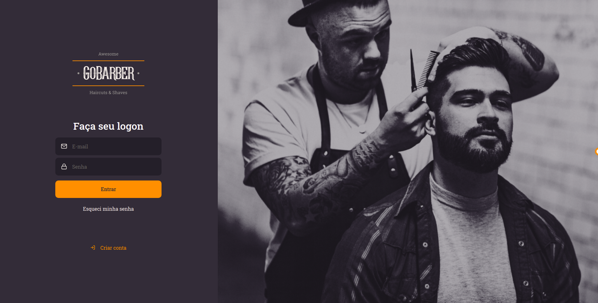
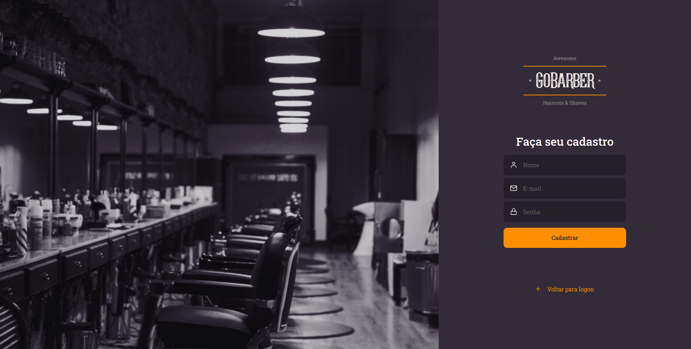

<h1 align="center">
  GoBarber
  <br /> <br />
  
  <br /> <br />
  
</h1>

# `Indice`

<a href="#ReactJS">1. ReactJS</a> <br />
<a href="#Tecnologias-utilizadas">2. Tecnologias utilizadas</a> <br />
<a href="#Como-baixar-o-projeto">3. Como baixar o projeto</a>

## ReactJS

Esse é um aplicativo para quem tem uma barbearia, o app se chama `**GoBarber**`, ele terá as funcionalidade de fazer a gestão da sua barbearia, ou seja, controlar a sua agenda.

É uma aplicação que se conectar com **backend**.

---

## Tecnologias utilizadas

O projeto foi desenvolvido utilizando as seguintes tecnologias:

- ReactJS
- Axios
- TypeScript
- React-spring
- Styled-Components
- History
- Polished
- ReactIcons
- uuidv4.

---
## Como baixar o projeto


```bash

  # Clonar o repositório
  $ git clone https://github.com/DevTeles/GoBarber.git

  # Entrar no diretório
  $ cd GoBarber

  # Instalar as dependências
  $ yarn

  # Start no pasta do projeto do backend
  $ yarn dev:server

  # Iniciar o projeto
  $ yarn start
```

<br /><br />
Desenvolvido por **Rafael Teles Vital**
